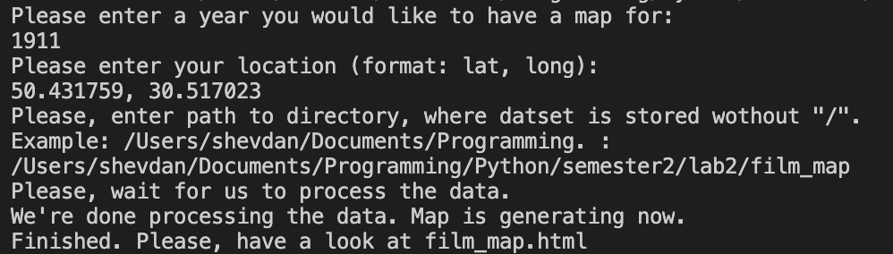
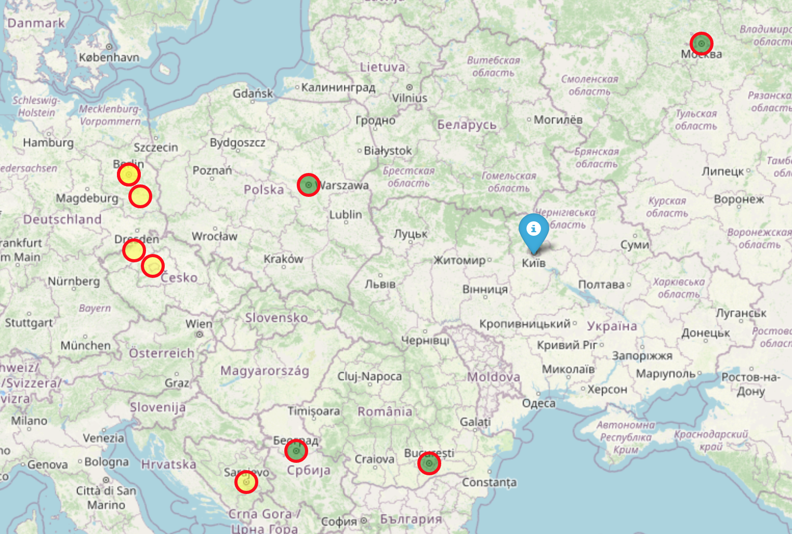

# film_map module
This module is designed for creating html page that contains map.

With this module, you can find places nearby, where films were filmed in specific year.

# Example
!Disclaimer! Requests for getting coordinates take a lot of time so
program might work for a long time. It works rather fast with distant years like 1911.

# HTML page description
Generated HTML page has header where style of the page is described,
and body containing python map visualization via folium and description
of popups, marks, markers and feature groups present in map.